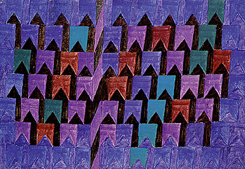
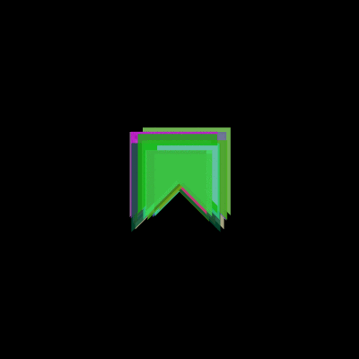

#  Orientação a objetos com bandeirinhas

Bandeirinhas são um tema recorrente da cultura visual brasileira, visível não só nas Festas Juninas como explorado largamente por artistas visuais como Alfredo Volpi: "Da série das fachadas surgem as bandeirinhas de festa junina, que, mais que um motivo popular, se tornam elementos compositivos autônomos"[1]. Foram escolhidas para gerar reconhecimento e interesse visual nas imagens e animações produzidas.

 

[1] [BANDEIRINHAS].In: ENCICLOPÉDIA Itaú Cultural de Arte e Cultura Brasileiras. São Paulo: Itaú Cultural, 2017. Disponível em: <http://enciclopedia.itaucultural.org.br/obra1797/bandeirinhas>.
Acesso em: 22 de Jun. 2017. Verbete da Enciclopédia. ISBN: 978-85-7979-060-7

Neste tutorial que se desenvolve  em  7 etapas  serão introduzidos conceitos de orientação a objetos: Classe, atributos de dados e métodos, instâncias e encapsulamento.

Não vamos falar ainda das questões de herança e composição. Para poder aproveitar o exemplo sugerimos que você revise antes o seguinte vocabulário e algumas ideias de programação:

* Métodos de desenho `rect`, `line`, `ellipse`, `beginShape`, `vertex` e `endShape`;
* Controle de atributos gráficos `fill`, `stroke`, `noStroke`, `noFill`, `background`;
* Controle de fluxo de execução e laços `if`, `else`, `for`;
* Declaração de funções com e sem parâmetros;
* Controle do sistema de coordenadas `pushMatrix`, `translate`, `rotate`, `scale`, `popMatrix`.

## 0. Definindo funções e deslocando o sistema de coordenadas

 

Antes de falar da orientação a objetos propriamente vamos começar com a definição de uma função bandeirinha() que recebe como parâmetros as coordenadas onde deve ser desenhada e um parâmetro de tamanho, produzindo um polígono fechado em forma de bandeirinha.

No lugar de somar as coordenadas de localização recebidas como parâmetros aos vértices dos polígonos usamos a estratégia de translação do sistema de coordenadas, moveremos a origem e em seguida desenharemos o polígono.

Antes da translação é necessário preservar o sistema original de coordenadas com o comando pushMatrix(). Isso pode ser feito simplesmente invocando pushMatrix() antes da translação e popMatrix() ao final do desenho.
```pde
void setup() {
  // Código chamado uma vez no início da execução pelo Processing 
  size(100, 100);  // define as dimensões do 'canvas' do Processing
  bandeirinha(50, 50, 50);  // chama a função bandeirinha
}
void bandeirinha(float px, float py, float tamanho) {
  // Desenha polígono em torno das coordenadas passadas, e tamanho
  float metade = tamanho / 2;
  pushMatrix();   // preservando o sistema de coordenadas anterior,
  translate(px, py);  // translação do sistema de coordenadas
  beginShape();  // inicia polígono
    vertex(-metade, -metade);
    vertex(-metade, metade);
    vertex(0, 0);
    vertex(metade, metade);
    vertex(metade, -metade);
  endShape(CLOSE);  // encerra polígono, fechando 	
  popMatrix();
}
```
## 1. Redesenhando formas e atualizando variáveis no laço principal


Para se obter o efeito de movimento (animação da bandeirinha) criamos um par de variáveis globais x e y, inicializadas no setup() com as coordenadas do meio da àrea de desenho. Note que o escopo global dessas variáveis precisa ser indicado com a palavra chave global quando pretendemos alterá-las.

O novo draw() cujo nome faz parte da infraestrutura do Processing para permitir animações, terá automaticamente a execução repetida continuamente, é o "laço principal" do sketch. Neste bloco vamos inicialmente limpar a tela com background() invocar a função de desenho bandeirinha() na posição indicada pelas variáveis x e y, incrementar as variáveis de posição e por fim checar se estas estão além de um certo limite e precisam ser alteradas (redefinindo a posição para um novo ciclo de incrementos).

```pde
float x, y;

void setup() {
  /* Código de configuração, executado no início pelo Processing */
  size(100, 100);  // área de desenho
  x = width / 2;
  y = height / 2;	// coordenadas do meio da área de desenho
}
void draw() {
  /* Laço principal de repetição do Processing */
  background(0);  // limpeza do frame, fundo preto
  bandeirinha(x, y, 50);  // desenha o polígono
  x++;  // incrementa o x
  y++;  // incrementa o y
  if (x > width + 25)  x = -25;
  if (y > height + 25) y = -25;
}
// continua com a def. da bandeirinha void bandeirinha(){...
```

## 2. Primeira aproximação da classe Bandeirinha

Vamos agora obter o mesmo comportamento usando um objeto da classe Bandeirinha. A classe é definida pelo bloco class Bandeirinha{} que começa com o método Bandeirinha(), construtor de um novo objeto da classe e que inicializa os atributos de dados (campos) de posição e tamanho. O método desenha() é praticamente a função que escrevemos no passo inicial, não requer mais os parâmetros de posição e tamanho, uma vez que usa os atributos de posição e tamanho do próprio objeto (instância) quando executado. O método anda() contém o código anteriormente usado para atualizar a posição nas variáveis globais, agora atualiza os atributos de dados (campos ou variáveis de instância) de posição do objeto. No bloco setup() criamos uma instância de bandeirinha no meio da área de desenho com a linha bandeira = new Bandeirinha(width / 2, height / 2, 50) e o bloco draw() vai repetidamente limpar a tela e chamar os métodos de desenho e atualização, bandeira.desenha() e bandeira.anda() respectivamente.

```pde
Bandeirinha bandeira; // variável global para uma bandeirinha

void setup() {
  /* define área de desenho e popula lista de bandeirinhas */
  size(100, 100);  // área de desenho
  float meia_largura = width / 2;
  float meia_altura = height / 2;
  bandeira = new Bandeirinha(meia_largura, meia_altura, 50);
}

void draw() {
  /* Limpa a tela, desenha e atualiza bandeirinhas */
  background(0);  // atualização do desenho, fundo preto
  bandeira.desenha();
  bandeira.anda();
}

class Bandeirinha {
  /* Classe Bandeirinha */
  float x, y, tamanho;
  Bandeirinha(float px, float py, float ptamanho) {
	x = px;
	y = py;
	tamanho = ptamanho;
  }

  void desenha() {
	/* Desenha polígono em torno das coordenadas do objeto */
	float metade = tamanho / 2;
	pushMatrix();   // preseservando o sistema de coordenadas anterior
	translate(x, y);  // translada o sistema de coordenadas
	beginShape();  // inicia polígono
	vertex(-metade, -metade);
	vertex(-metade, metade);
	vertex(0, 0);
	vertex(metade, metade);
	vertex(metade, -metade);
	endShape(CLOSE);  // encerra polígono, fechando no primeiro vértice
	popMatrix();
  }

  void anda() {
	/* atualiza a posição do objeto e devolve do lado oposto se sair */
	x++;
	y++;
	if (x > width + 25)  x = -25;
	if (y > height + 25)   y = -25;
  }
}
```

## 3. Instanciando mais alguns objetos


A vantagem da estruturação e encapsulamento de termos um objeto bandeira criado por uma classe Bandeirinha pode começar a ser visto quando instanciamos mais de uma bandeirinha.

```pde
Bandeirinha bandeira_0, bandeira_1, bandeira_2; // lista de objetos

void setup() {
  /* define área de desenho e popula lista de bandeirinhas */
  size(100, 100);  // área de desenho
  float meia_largura = width / 2;
  float meia_altura = height / 2;
  bandeira_0 = new Bandeirinha(meia_largura, meia_altura, 50);
  bandeira_1 = new Bandeirinha(80, 10, 30);
  bandeira_2 = new Bandeirinha(10, 40, 20);
}

void draw() {
  /* Limpa a tela, desenha e atualiza bandeirinhas */
  background(0);  // atualização do desenho, fundo preto
  bandeira_0.desenha();
  bandeira_0.anda();
  bandeira_1.desenha();
  bandeira_1.anda();
  bandeira_2.desenha();
  bandeira_2.anda();
}
```

## 4. Ampliando a classe, mudando o comportamento e adicionando outras propriedades.


O passo seguinte é dado ampliando o código da classe Bandeirinha.

No método construtor Bandeirinha():
1. Sorteio do tamanho, caso nenhum tenha sido passado 0 na expressão construtora;
2. Sorteio da velocidade, decomposta nos componentes horizontal vx e vertical vy;
3. Sorteio da cor, ligeiramente translúcida.

No método desenha():
1. Remoção do contorno com noStroke();
2. Aplicação da cor de preenchimento com fill(cor).

No método anda():
1. Atualização da posição pela soma dos componentes de velocidade na posição;
2. Tratamento da saída do objeto da àrea de desenho por qualquer dos lados.

```pde
class Bandeirinha {
  /* Classe Bandeirinha, cor sorteada, tamanho sorteado */
  float x, y, vx, vy, tamanho;
  color cor;
  Bandeirinha(float px, float py, float ptamanho) {
	x = px;
	y = py;
	if (ptamanho != 0) {
  	tamanho = ptamanho;
	} else {
  	tamanho = random(50, 200);
	}
	vx = random(-1, 1);
	vy = random(-1, 1);
	cor  = color(random(255), // R
  	            random(255), // G
  	            random(255), // B
  	            200);  // alpha
  }

  void desenha() {
	/* Desenha polígono em torno das coordenadas do objeto */
	float metade = tamanho / 2;
	pushMatrix();   // preseservando o sistema de coordenadas anterior
	translate(x, y);  // translada o sistema de coordenadas
	noStroke() ; // sem contorno
	// se o mouse estiver longe, normal, senão, branca
	if (dist(mouseX, mouseY, x, y) > metade) {
  	  fill(cor);
	} else {
  	  fill(255, 100);
	}
	beginShape();  // inicia polígono
	vertex(-metade, -metade);
	vertex(-metade, metade);
	vertex(0, 0);
	vertex(metade, metade);
	vertex(metade, -metade);
	endShape(CLOSE);  // encerra polígono, fechando no primeiro vértice
	popMatrix();
  }
  void anda() {
	/* atualiza a posição do objeto e devolve do lado oposto se sair */
	x += vx;
	y += vy;
	float metade = tamanho / 2;
	if (x > width + metade) x = -metade;
	if (y > height + metade) y = -metade;
	if (x < -metade) x = width + metade;
	if (y < -metade) y = height + metade;
  }
}
```

## 5. Uma lista de objetos

Uma estrutura de dados, no caso uma lista do tipo ArrayList, pode de maneira muito simples conter referências para um grande número de objetos.
Aqui chegamos rapidamente a um comportamento visualmente interessante instanciando 50 bandeirinhas no setup() e em seguida no draw() iteramos por estas bandeirinhas com um tipo de laço conhecido como "for each" com a estrutura for (Tipo objeto : lista_de_objetos){ }. 

```pde
ArrayList<Bandeirinha> bandeirinhas; // lista de objetos

void setup() {
  /* define área de desenho e popula lista de bandeirinhas */
  size(400, 400);  // área de desenho
  float meia_largura = width / 2;
  float meia_altura = height / 2;
  bandeirinhas = new ArrayList<Bandeirinha>();
  for (int i=0; i <50; i++) {
	bandeirinhas.add(new Bandeirinha(meia_largura, meia_altura, 0));
  }
}

void draw() {
  /* Limpa a tela, desenha e atualiza bandeirinhas */
  background(0);  // atualização do desenho, fundo preto
  for (Bandeirinha bandeira : bandeirinhas) {
	bandeira.desenha();
	bandeira.anda();
  }
}
```

## 6. Acrescentando e removendo objetos; Mudança da cor com o mouse próximo.

Como extra, acrescentamos exemplo dos métodos append() e remove() do ArrayList, chamados nos eventos de clique do mouse ou acionamento da barra de espaço no teclado, acrescentando ou removendo objetos respectivamente. O método de desenha() da bandeirinha agora sofre a influência da distância do mouse.





```pde
void mousePressed() {
  /* Acrescenta pequena bandeirinha branca */
  Bandeirinha nova_bandeirinha = new Bandeirinha(mouseX, mouseY, 25);
  nova_bandeirinha.cor = color(255);  // forçando que seja branca!
  bandeirinhas.add(nova_bandeirinha);
}

void keyPressed() {  
  /* tecla 'espaço' remove a última bandeirinha da lista */
  int num_bandeirinhas =  bandeirinhas.size();
  if (key == ' ' && num_bandeirinhas > 1) {
     bandeirinhas.remove(num_bandeirinhas - 1);
  }
}

class Bandeirinha {
  /* Classe Bandeirinha, cor sorteada, tamanho sorteado caso tamanho = 0 */
  float x, y, vx, vy, tamanho;
  color cor;
  Bandeirinha(float px, float py, float ptamanho) {
    x = px;
    y = py;
    if (ptamanho != 0) {
      tamanho = ptamanho;
    } else {
      tamanho = random(50, 200);
    }
    vx = random(-1, 1);
    vy = random(-1, 1);
    cor = color(random(255), // R
      random(255), // G
      random(255), // B
      200);  // alpha
  }

  void desenha() {
    /* Desenha polígono em torno das coordenadas do objeto */
    float metade = tamanho / 2;
    pushMatrix();   // preseservando o sistema de coordenadas anterior
    translate(x, y);  // translada o sistema de coordenadas
    noStroke() ; // sem contorno
    // se o mouse estiver longe, normal, senão, branca
    if (dist(mouseX, mouseY, x, y) > metade) {
      fill(cor);
    } else {
      fill(255, 100);
    }
    beginShape();  // inicia polígono
    vertex(-metade, -metade);
    vertex(-metade, metade);
    vertex(0, 0);
    vertex(metade, metade);
    vertex(metade, -metade);
    endShape(CLOSE);  // encerra polígono, fechando no primeiro vértice
    popMatrix();
  }
  void anda() {
    /* atualiza a posição do objeto e devolve do lado oposto se sair */
    x += vx;
    y += vy;
    float metade = tamanho / 2;
    if (x > width + metade) x = -metade;
    if (y > height + metade) y = -metade;
    if (x < -metade) x = width + metade;
    if (y < -metade) y = height + metade;
  }
}
```

### Referências:

VILLARES, Alexandre. B. A.; MOREIRA, Daniel. de C.; GOMES, Monica Rizzolli. [**Ensino de programação em um contexto de exploração gráfica com Processing modo Python.**](https://villares.github.io/mestrado/VILLARES_MOREIRA_GOMES_GRAPHICA_2017) GRAPHICA 2017: XII International Conference on Graphics Engineering for Arts and Design. 2017.

[Objects tutorial](https://processing.org/tutorials/objects/) by Daniel Shiffman @ Processing.org

